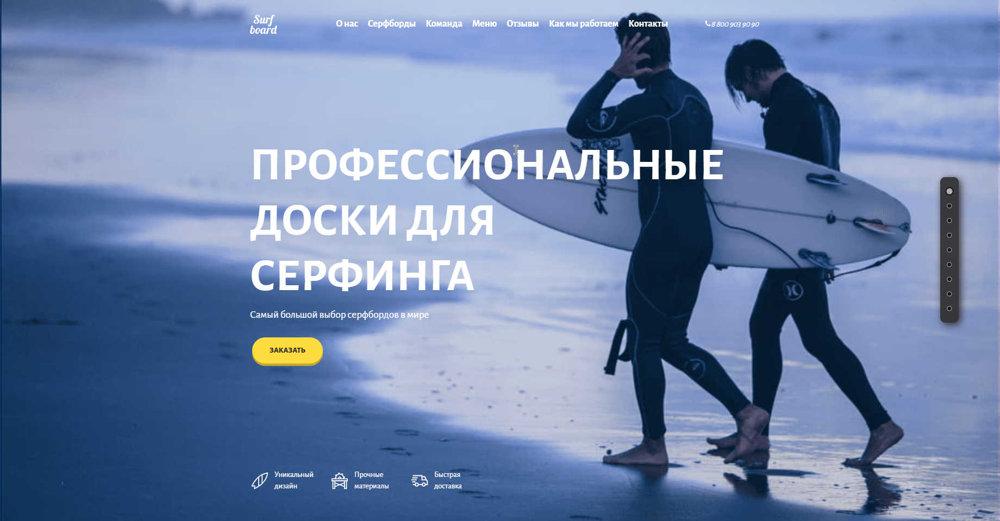

## 💼 Project Description



- Project: Surfboard — Premium Interactive One-Page Landing Page for a Surfboard Brand.
- Objective: End-to-end development of a high-converting, fully responsive landing page featuring seamless screen-by-screen scrolling, custom media players, and interactive map integrations.
- Tech Stack: HTML5, CSS3 / SCSS (modular structure), JavaScript (ES6+), jQuery, Swiper.js, Yandex Maps API.
- Key Deliverables:
- Engineered a flawless One-Page Scroll navigation system with touch-gesture optimization for mobile devices.
  - Built a highly maintainable codebase using modular architecture (SCSS styling and JavaScript logic split into independent functional components: video.js, order.js, map.js).
  - Developed an interactive product catalog and a dynamic testimonial slider powered by Swiper.js.
  - Implemented a custom-styled HTML5 video player and integrated an interactive maps section using Yandex Maps API.
  - Integrated a multi-input checkout and delivery form with client-side data validation.
  - Delivered 100% responsive, cross-browser Pixel-Perfect layout optimized for all device sizes.

---

## 🛠️ Quick Start

To run this project locally, follow these simple steps:

1. **Clone the repository:**
   ````bash
   git clone https://github.com
   ```2. **Launch the website:**
   Open the `index.html` file directly in your browser, or use a local development server like the *Live Server* extension in VS Code.
   ````

---
